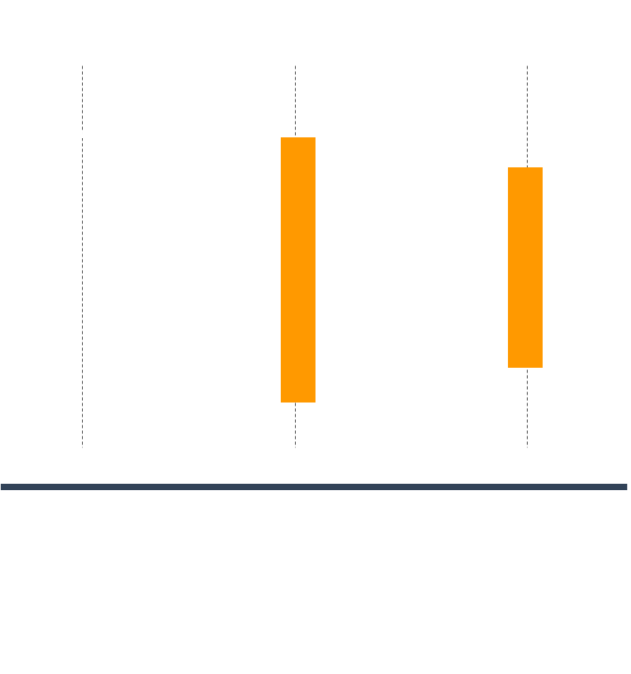
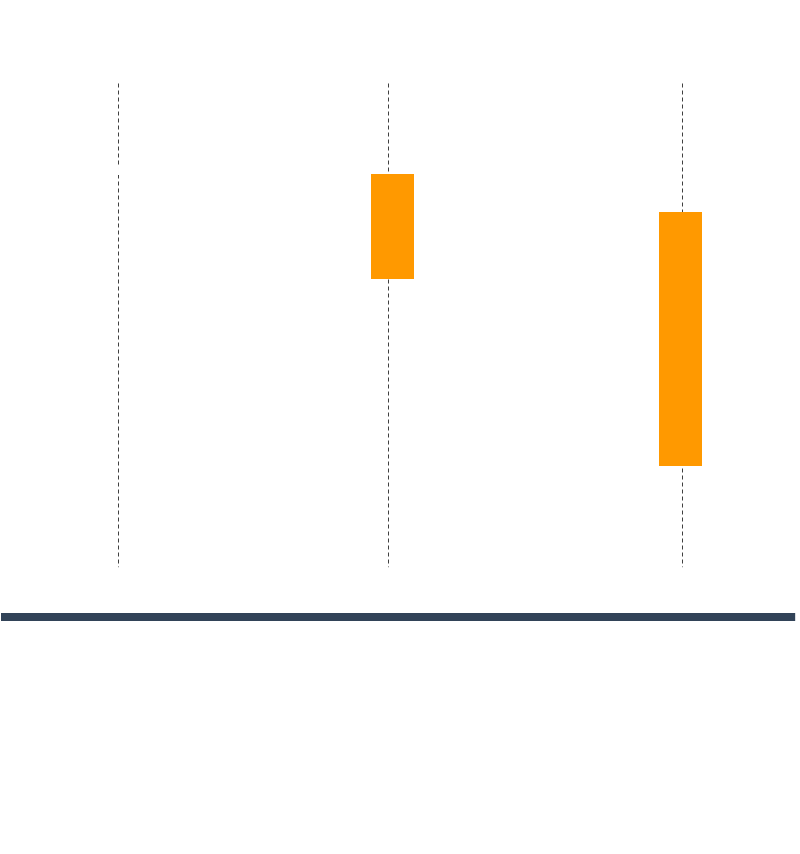
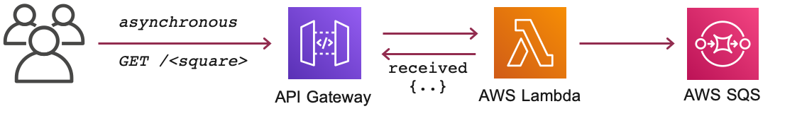

# Asynchronous Messaging with AWS Lambda

A common architectural pattern is to loosely couple microservices is to expose an API. REST APIs tend to be designed with synchronous communications, where a response is required. Synchronous functions are used when you need to know the result of an operation before moving on to the next one.

For example, if a user-facing API needs to perform a lot of time-consuming processing(from a few seconds to a minute), Your user has to wait for process to complete, which can lead to bad user experience.(_Who likes to wait anyway?_)



Sometimes, You dont have to process and return the ressponse immediately. It is good enough to inform the user that the message had been received and will be processed later. In the previous example, We can store the message in a queue or a topic and return the reponse immediately to the user. We can process the messages in the background without making the user to wait. For example for an asynchronous function is video encoding or image processing process, You can respond back informing the user that the processing had begun.



AWS Lambda functions can either be invoked synchronously or asynchronously. Functions invoked synchronously and asynchronously are handled in different ways when they fail, which can cause some unexpected side effects in your program logic.

Synchronously invoking application are responsible for all failure retries. Lambda functions that are invoked asynchronously do not rely on the invoking application for failure retries. The invocation will be retried twice with delays in-between. If it fails on both retries, the event is discarded.

With asynchronous invocations, you are able to set up a _Dead Letter Queue(DLQ)_ which can be used to keep the failed event from being discarded. The Dead Letter Queue allows you to send unprocessed events to an Amazon SQS or SNS queue for you to build logic to deal with.

In this article, we will build an messaging architecture to demonstrate synchronous and asynchronous invocation. The stacks are generated using [AWS Cloud Development Kit (CDK)][102]. The prerequisites to build this architecture are listed below

1. ## 🧰 Prerequisites

   This demo, instructions, scripts and cloudformation template is designed to be run in `us-east-1`. With few modifications you can try it out in other regions as well(_Not covered here_).

   - 🛠 AWS CLI Installed & Configured - [Get help here](https://youtu.be/TPyyfmQte0U)
   - 🛠 AWS CDK Installed & Configured - [Get help here](https://www.youtube.com/watch?v=MKwxpszw0Rc)
   - 🛠 Python Packages, _Change the below commands to suit your OS, the following is written for amzn linux 2_
     - Python3 - `yum install -y python3`
     - Python Pip - `yum install -y python-pip`
     - Virtualenv - `pip3 install virtualenv`

1. ## ⚙️ Setting up the environment

   - Get the application code

     ```bash
     git clone https://github.com/miztiik/serverless-async-lambda-api.git
     cd serverless-async-lambda-api
     ```

1. ## 🚀 Prepare the dev environment to run AWS CDK

   We will cdk to be installed to make our deployments easier. Lets go ahead and install the necessary components.

   ```bash
   # If you DONT have cdk installed
   npm install -g aws-cdk

   # Make sure you in root directory
   python3 -m venv .env
   source .env/bin/activate
   pip3 install -r requirements.txt
   ```


    The very first time you deploy an AWS CDK app into an environment _(account/region)_, you’ll need to install a `bootstrap stack`, Otherwise just go ahead and deploy using `cdk deploy`.

    ```bash
    cdk bootstrap
    cdk ls
    # Follow on screen prompts
    ```

    You should see an output of the available stacks,

    ```bash
    serverless-async-lambda-api
    ```

1. ## 🚀 Deploying the application

   Let us walk through each of the stacks _serverless-async-lambda-api_. This stack creates the following resources,

   - A Lambda function that can compute the _square_ of an given number
     - For a _synchronous_ request, the function will return an response with the square of the given number
     - For an _asynchronous_ request, the function will return a response as message received and the processed output will be stored in a AWS SQS Queue
   - API Gateway to make it easier for us to trigger the lambda

   

   Initiate the deployment with the following command,

   ```bash
   cdk deploy serverless-async-lambda-api
   ```

   Check the `Outputs` section of the stack to access the `GetSquareApiUrl`.

1. ## 🔬 Testing the solution

   The _Outputs_ section of the `serverless-async-lambda-api` stack has the required information on the urls

   ```bash
   API_ENDPOINT_URL="https://7z5waloht5.execute-api.us-east-1.amazonaws.com/miztiik/square/2"

   # Synchromous request
   curl -X GET ${API_ENDPOINT_URL}
   ```

   Expected Output,

   ```json
   {
     "api_stage": "miztiik",
     "api_request_id": "28e20dd-8f54-4cad-ae6d-4b1b2129bc77",
     "api_resource_path": "/square/{number}",
     "http_method": "GET",
     "source_ip": "13.3.81.39",
     "user-agent": "Mozilla/5.0 (Macintosh; Intel Mac OS X 10_14_6) AppleWebKit/537.36 (KHTML, like Gecko) Chrome/81.0.4103.116 Safari/537.36",
     "synchronous_invocation": "true",
     "square_of_your_number_is": 4
   }
   ```

   You can notice the function takes the input `{number}` 2 in this case and return an _synchronous_ response. I have added key _synchronous_invocation_ along with the _square_. Now lets try and do an asynchronous request. For this we need to add an custom header to the request<sup>[1]</sup>. We can use `curl` to do that,

   ```bash
   # Asynchromous request - by setting header InvocationType to Event
   curl -X GET ${API_ENDPOINT_URL} -H "InvocationType:Event"
   ```

   Expected Output,

   ```json
   {
     "api_stage": "miztiik",
     "api_request_id": "c72ce06-031d-4409-808a-ed56c74eb746",
     "api_resource_path": "/square/{number}",
     "http_method": "GET",
     "source_ip": "13.3.81.39",
     "user-agent": "curl/7.54.0",
     "asynchronous_invocation": "true",
     "message": "Event received. Check queue/logs for status"
   }
   ```

   If you want to check the output, you can retreive the message from SQS and inspect the message body for the payload.

   ```bash
   # Get SQS Messages
   DEST_QUEUE_NAME="async_get_square_fn_dest_queue"
   QUEUE_URL=$(aws sqs create-queue --queue-name ${DEST_QUEUE_NAME} | jq -r '.QueueUrl')
   aws sqs receive-message --queue-url ${QUEUE_URL}
   aws sqs receive-message --queue-url ${QUEUE_URL} | jq -r '.Messages.Body'
   ```

   You can check the logs in cloudwatch for more information or increase the logging level of the lambda functions by changing the environment variable from `INFO` to `DEBUG`

1. ## 🧹 CleanUp

   If you want to destroy all the resources created by the stack, Execute the below command to delete the stack, or _you can delete the stack from console as well_

   - Resources created during [deployment](#-resource-deployment-using-aws-cdk)
   - Delete CloudWatch Lambda LogGroups
   - _Any other custom resources, you have created for this demo_

   ```bash
   # Delete from cdk
   cdk destroy cognito-identity-provider

   # Follow any on-screen prompts

   # Delete the CF Stack, If you used cloudformation to deploy the stack.
   aws cloudformation delete-stack \
       --stack-name "MiztiikAutomationStack" \
       --region "${AWS_REGION}"
   ```

   This is not an exhaustive list, please carry out other necessary steps as maybe applicable to your needs.

## 📌 Who is using this

This repository teaches developers, Solution Architects & Ops Engineers how to build complete architecture in AWS. Based on that knowledge these Udemy [course #1][103], [course #2][102] have been created to enhance your skills.

### 💡 Help/Suggestions or 🐛 Bugs

Thank you for your interest in contributing to our project. Whether it's a bug report, new feature, correction, or additional documentation or solutions, we greatly value feedback and contributions from our community. [Start here][200]

### 👋 Buy me a coffee

[](https://ko-fi.com/Q5Q41QDGK)Buy me a [coffee ☕][900].

### 📚 References

1. [Set up asynchronous invocation of the backend Lambda function][1]

1. [AWS Docs - API Gateway mapping template][2]

1. [Pass custom headers through API Gateway to a Lambda function][3]

1. [AWS Asynchronous Messaging Workshop][4]

### 🏷️ Metadata

**Level**: 300

[1]: https://docs.aws.amazon.com/apigateway/latest/developerguide/set-up-lambda-integration-async.html
[2]: https://docs.aws.amazon.com/apigateway/latest/developerguide/api-gateway-mapping-template-reference.html
[3]: https://aws.amazon.com/premiumsupport/knowledge-center/custom-headers-api-gateway-lambda/
[4]: https://github.com/aws-samples/asynchronous-messaging-workshop
[100]: https://www.udemy.com/course/aws-cloud-security/?referralCode=B7F1B6C78B45ADAF77A9
[101]: https://www.udemy.com/course/aws-cloud-security-proactive-way/?referralCode=71DC542AD4481309A441
[102]: https://www.udemy.com/course/aws-cloud-development-kit-from-beginner-to-professional/?referralCode=E15D7FB64E417C547579
[103]: https://www.udemy.com/course/aws-cloudformation-basics?referralCode=93AD3B1530BC871093D6
[200]: https://github.com/miztiik/cfn-challenges/issues
[899]: https://www.udemy.com/user/n-kumar/
[900]: https://ko-fi.com/miztiik
[901]: https://ko-fi.com/Q5Q41QDGK
